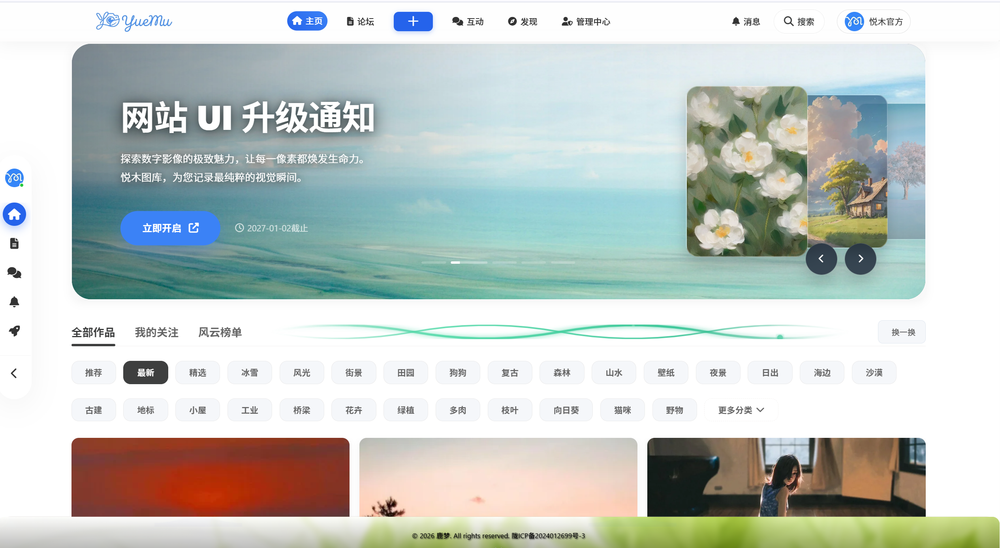
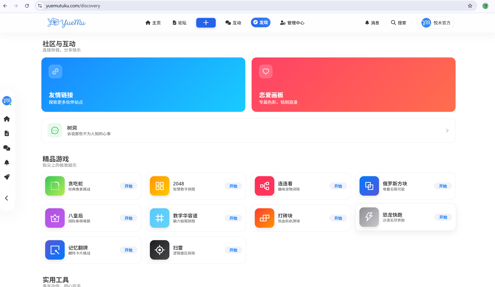
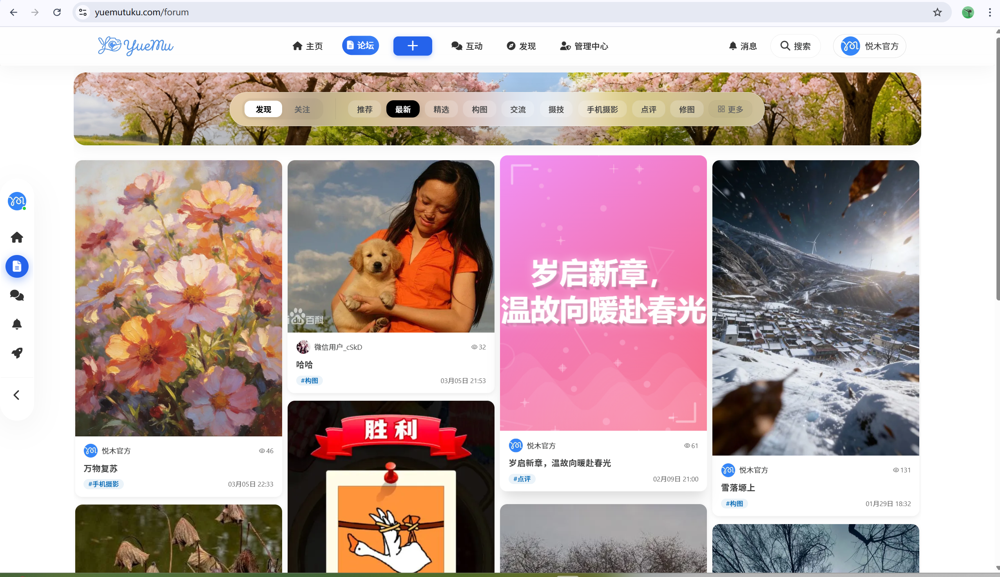
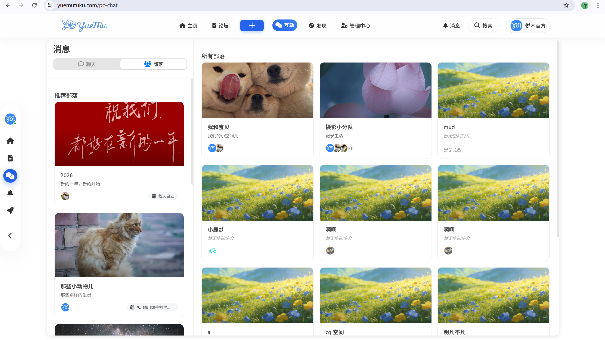
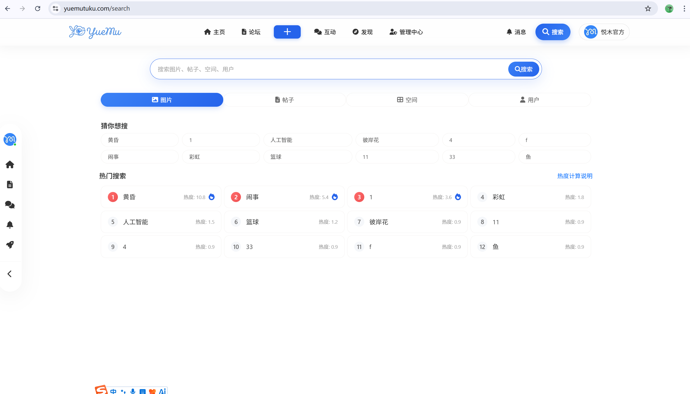
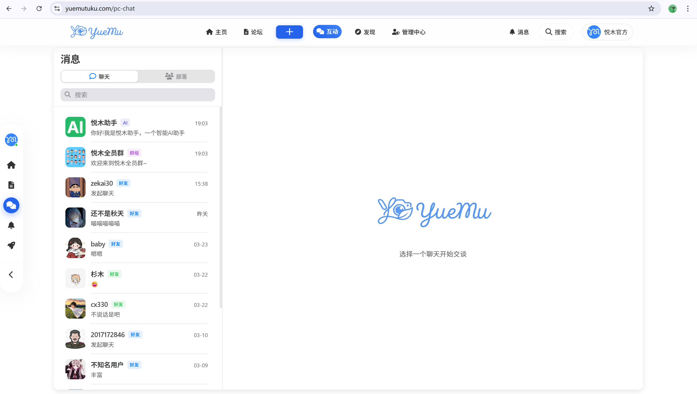
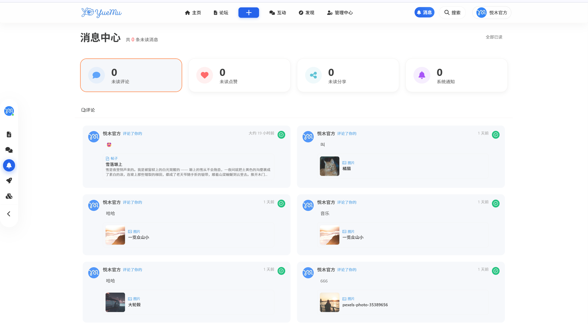
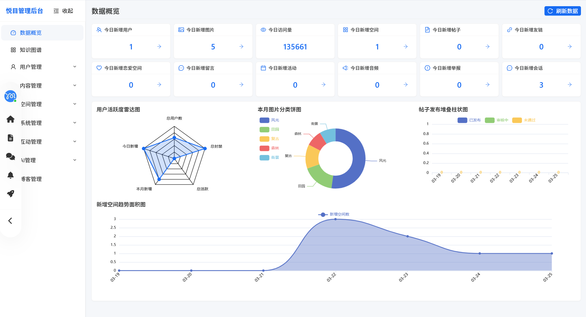
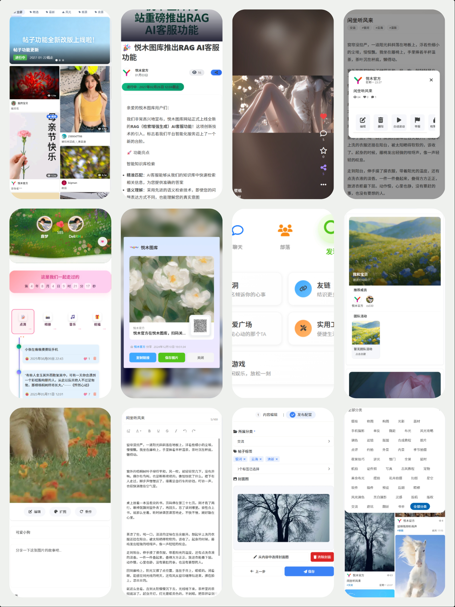

# 悦木图库 (Yuemu Tuku) - 发现、分享、创造美好瞬间

<p align=center>
  <a href="https://www.yuemutuku.com/home" style="border-radius: 50%;width: 100px;height: 100px">
    
  </a>
</p>

<p align="center">
   <a target="_blank" href="https://www.yuemutuku.com/home">
      
      
      
      
      
      
      
   </a>
</p>

[体验地址](#-在线地址) | [目录结构](#-目录结构) | [功能全景](#-功能全景) | [技术架构](#-技术架构) | [开发指南](#-快速启动)

---

## 🔗 在线地址

**项目官网：** [悦木 图库](https://www.yuemutuku.com)

**官方文档：** [悦木文档指南](https://official.yuemutuku.com/)

**项目源码：** [GitHub 仓库](https://github.com/humenglover/yuemu) | [Gitee 仓库](https://gitee.com/lumenglover/yuemu)

> 您的 Star 是我坚持的动力，感谢支持，欢迎提交 PR 共同改进。

---

## 📂 目录结构

本项目采用微服务化思想，实现了业务逻辑与 AI 的深度解耦：

```bash
yuemu
├── backend-java        # 基于 Spring Boot 的核心业务中台 (鉴权、空间、图库管理)
├── backend-python      # 基于 FastAPI 的 AI 服务 (RAG 问答、YOLO 检测、图像处理)
├── frontend-vue        # Vue 3 + Vite 驱动的高清多端适配前端
├── deploy-docker       # Docker 容器化全栈部署脚本
├── pictures            # 项目说明文档静态素材
└── tools               # 包含数据抓取与自动化脚本（如 Pexels 抓取等）
```

---

## 🌟 项目简介

**悦木图库 (Yuemu Tuku)** 是一个汇聚海量素材、注重创意分享的综合性社区平台。它不仅提供**专业级的图片生命周期管理**与**深度协作空间**，更集成了**动态交流广场**、**实用工具箱**以及**内置小游戏中心**。通过 Java 异步并发架构与 Python AI 智能引擎的深度融合，为创作者提供发现、分享与创造美好瞬间的极致体验。

---

## 🚀 功能全景

### 1. 🖼️ 专业图库系统
*   **多源上传**: 支持本地单图/批量上传、URL 远程抓取及自动化资源采集。
*   **多维极速检索**: 支持关键词、分类、标签的组合检索；支持**以图搜图**与**色相检索**。
*   **智能管理**: 具备 AI 自动打标、色彩分析、图片级权限管控及闭环的草稿协作流程。

### 2. 👥 深度协作空间
*   **双模式空间体系**: 个人私有空间与团队协作空间（成员权限、操作审计）。
*   **资源配额管控**: 动态分配存储配额与数量限制，支持精细化的空间分析看板。

### 3. 📜 动态社区广场
*   **互动社区**: 完整的帖子发布系统、多级反馈、关注/粉丝动态及消息中心。
*   **趣味互动**: 拥有 **表白墙 (Love Board)**、**弹幕互动** 及 **树洞系统**。

### 4. 🛠️ 实用工具箱 (8+ Tools)
*   **效率增强**: 计算器、计时器、番茄钟、便签墙。
*   **趣味辅助**: 今天吃什么（食谱转盘）、随机数生成、进位制转换。

### 5. 🎮 趣味娱乐中心 (10+ Games)
*   内置经典：贪吃蛇、2048、俄罗斯方块、扫雷、八皇后、记忆翻牌、打砖块、恐龙快跑等。

### 6. 🤖 AI 智能引擎 (AI Booster)
*   **RAG 助手**: 挂载专业知识库，支持 SSE 流式响应与 DeepSeek AI 对话。
*   **视觉黑科技**: YOLOv8 目标探测、AI 去背景、人脸打码、AI 扩图及人像抠图。

### 7. 🔐 生产级运营后台
*   涵盖用户、图片、帖子、评论、举报、Redis 监控等 20+ 个管理子系统。

---

## 🏗️ 技术架构

悦木采用 **"Front-Biz-AI"** 三维分层架构：

- **🎨 全栈前端**: Vue 3 + Vite 5 + Ant Design Vue / Vant UI，支持多端自适应。
- **⚙️ 业务中台**: Spring Boot 2.6 + Sa-Token + Disruptor + ShardingSphere。
- **🧠 AI 智能集群**: FastAPI + LangChain Agent + YOLOv8 + MODNet。
- **💾 存储层**: MySQL 8.0 (分表) + Redis 6 + ElasticSearch 7.17 + 腾讯云 COS。

---

## 📸 站点演示

### 💻 PC 端全景展示

| 🎨 首页大厅 | 🏛️ 发现广场 |
| :---: | :---: |
|  |  |

| 📜 动态论坛 | 👥 团队协作 |
| :---: | :---: |
|  |  |

| 🔍 智能搜索 | 💬 实时聊天 |
| :---: | :---: |
|  |  |

| 🔔 消息中心 | 🔐 后台管理 |
| :---: | :---: |
|  |  |

---

### 📱 移动端自适应

| 🎨 首页大厅 | 📸 详情解析 |
| :---: | :---: |
|  |  |

---

## 🛠️ 快速启动

1.  **环境准备**: JDK 11+, Node 18+, Python 3.10+, Redis 6, MySQL 8.0, ES 7.17。
2.  **配置**: 修改 `backend-java` 与 `backend-python` 中的配置文件。
3.  **运行**:
    *   **Java**: 启动 `yuemu-picture-backend`。
    *   **Python**: `cd backend-python && python main.py`。
    *   **Vue**: `cd frontend-vue && npm run dev`。

---

## 🛡️ 联系与交流

如果您发现 Bug 或有建议，欢迎提交 Issue。
- **官方网站**: [www.yuemutuku.com](https://www.yuemutuku.com)
- **联系邮箱**: 109484028@qq.com

---
**悦木图库 - 致力于创造极致的视觉分享体验。**
